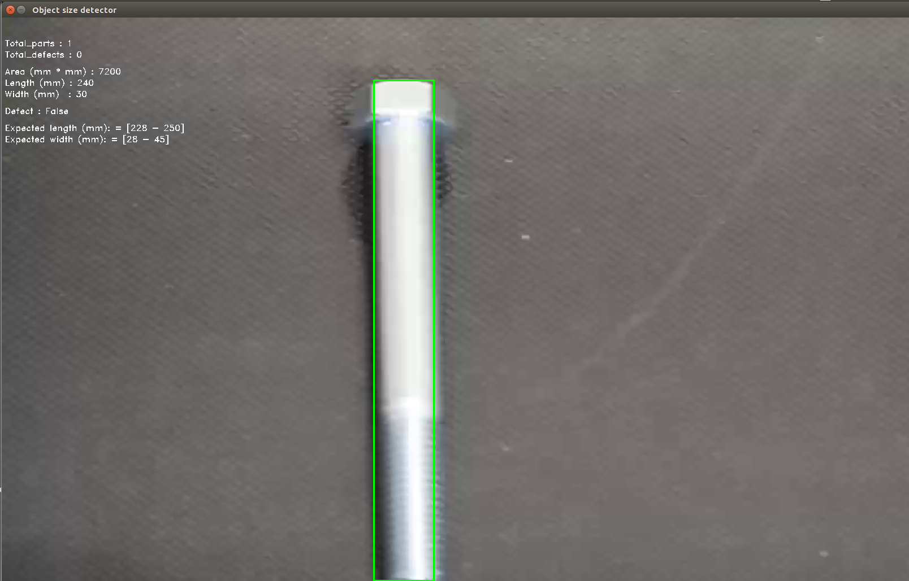
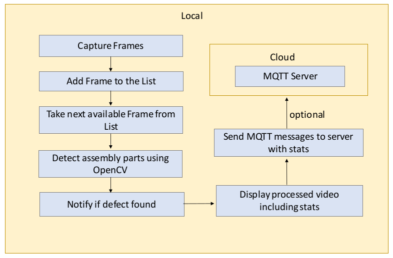
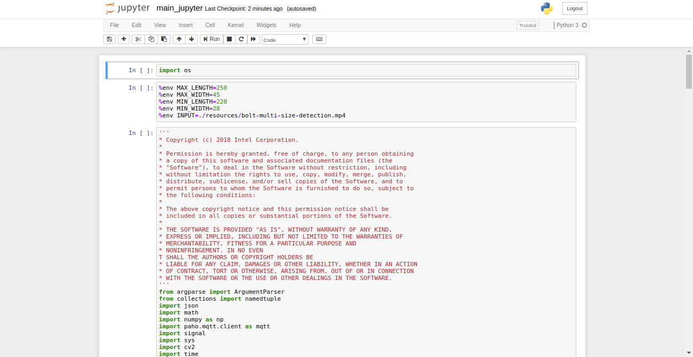

# Object Size Detector

| Details            |              |
|-----------------------|---------------|
| Target OS:            |  Ubuntu\* 16.04 LTS   |
| Programming Language: |  Python 3.5\* |
| Time to Complete:     |  45 min     |



## Introduction

This object size detector application is one of a series of computer vision (CV) reference implementations using the Intel® Distribution of OpenVINO™ toolkit. This application demonstrates how to use CV to detect and measure the approximate length, width and size of assembly line parts. It is designed to work with an assembly line camera mounted above the assembly line belt. The application monitors mechanical parts as they are moving down the assembly line and raises an alert if it detects a part on the belt outside a specified size range.

## Requirements

### Hardware
* 6th to 8th generation Intel® Core™ processor with Iris® Pro graphics or Intel® HD Graphics

### Software
* [Ubuntu\* 16.04 LTS](http://releases.ubuntu.com/16.04/)<br>
   NOTE: Use kernel versions 4.14+ with this software.<br> 
    Determine the kernel version with the below uname command. 
    ```
    uname -a
    ```
* Intel® Distribution of OpenVINO™ toolkit 2018 R5 release toolkit
* Jupyter* notebook v5.7.0

## How it works

This object size detector works with a video source, such as a camera. The application captures video frames and processes the frame data with OpenCV algorithms. It detects objects on the assembly line and calculates the length and width of the objects. If the calculated length and width  is not within a predefined range, the application raises an alert to notify the assembly line operator. Optionally, the application sends data to a message queuing telemetry transport (MQTT) machine, or machine messaging server, as a part of an assembly line data analytics system.



## Pre-requisites

### Install Intel® Distribution of OpenVINO™ toolkit
Before running the application, install the Intel® Distribution of OpenVINO™ toolkit. For details, see [Installing the OpenVINO™ toolkit for Linux*](https://software.intel.com/en-us/openvino-toolkit/choose-download/free-download-linux)

## Setting the build environment

### Install Python* Dependencies
```
sudo apt-get update
sudo apt-get install python3-pip
sudo apt-get install python3-numpy
```
Install Jupyter using the command:
```
sudo pip3 install jupyter
```
### Machine-to-Machine Messaging with MQTT

**Install mosquitto**
```
sudo apt-get update
sudo apt-get install mosquitto mosquitto-clients
```
**Install paho-mqtt-python**
```
sudo pip3 install paho-mqtt
```
**To run the mosquitto server**
```
mosquitto
```
**Note:** If the output of the above command is
```
1543918812: mosquitto version 1.4.8 (build date Wed, 05 Sep 2018 15:51:27 -0300) starting
1543918812: Using default config.
1543918812: Opening ipv4 listen socket on port 1883.
1543918812: Error: Address already in use
```
It means mosquitto server is already running in the background.<br>


**To Subscribe the data**
```
mosquitto_sub -h localhost -t defects/counter
```


## Run the code on Jupyter*

Open a new terminal. Configure the environment to use the Intel® Distribution of OpenVINO™ toolkit once per session by running the **source** command on the command line:
```
source /opt/intel/computer_vision_sdk_2018.5.445/bin/setupvars.sh -pyver 3.5
```

Go to object-size-detector-python directory
```
cd <path-to-object-size-detector-python>
```

Open the Jupyter notebook
```
jupyter notebook
```

**Folow the below steps :**


1. Click on **New** button present on the right side of the Jupyter window.

2. Click on **Python 3** option from the drop down list.

3. In the first cell, type **import os** and press **Shift+Enter**.

4. The MIN_LENGTH, MIN_WIDTH, MAX_LENGTH, MAX_WIDTH parameters set the minimum and maximum values for length and width.<br>
   Export these environment variables in second cell and press **Shift+Enter**:<br>
    %env MAX_LENGTH=250<br>
    %env MAX_WIDTH=45<br>
    %env MIN_LENGTH=228<br>
    %env MIN_WIDTH=28<br>
    %env INPUT=./resources/bolt-multi-size-detection.mp4<br>
5. Skip this step if field of view of camera and the distance between object and camera are not availabe. These inputs if available are exported as environment variables as given below and press **Shift+Enter**.<br>
   %env DISTANCE = 370<br>
   %env FIELD_OF_VIEW = 60
 

5.  Copy the code of **main_jupyter.py** and paste it in the third cell of Jupyter.

6.  Click on **Kernel** present in the menu and then select **Restart & Run All** from the drop down list.

7.  On the pop-up window, click on **Restart and Run All Cells**.

    **Note:** To get the input feed from camera, change **%env INPUT=./resources/bolt-multi-size-detection.mp4** in step 4 to **%env INPUT=CAM** and then follow steps 6 and 7.

* Alternatively, code can be run in the following way:

    * Click on **main_jupyter.ipynb** file in the Jupyter notebook window.
    
    * Click on **Kernel** present in the menu and then select **Restart & Run All** from the drop down list.

    * On the pop-up window, click on **Restart and Run All Cells**.



**Note:**<br>
To get the input feed from camera, change **%env INPUT=./resources/bolt-multi-size-detection.mp4** to **%env INPUT=CAM** in second cell and then follow steps 6 and 7.

